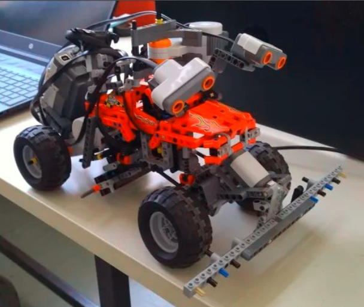

# Lego NXT Minesweeper



  A custom-made firmware for LEGO NXT bricks, with special interest for NXT-powered vehicles, implementing a minesweeper scenario as proof-of-concept.
  Part of a course on Embedded Systems (HY428 :: CSD UOC)

## Table of Contents

- [Introduction](#introduction)
- [Features](#features)
- [Build & Flash](#build)
- [Usage](#usage)
- [Contributing](#contributing)

## Introduction

  Two NXT-powered vehicles with ultrasonic, IR and sound sensors collaborate to navigate through a minefield.

  The 1st vehicle (minesweeper) navigates the "minefield" and detects/defuses "mines" on its way, as well as obstacles using the ultrasonic sensors, clearing the way. Simultaneously, it communicates its traversed path through sound sequences.

  The 2nd vehicle (mapper) detects and emulates the movements of the larger vehicle on a smaller scale, and using a writing instrument (pen/pencil), maps the mine-free and obstacle-free path to a piece of paper.

## Features

- Simulated minefield navigation
- Obstacle detection & avoidance
- Sound communication
- Mapping of path traversed
- Colour recognition (unused)

## Build & Flash

```cd ./mapper; make```

Connect 1st LEGO brick via USB to flash firmware.

```make download```

```cd ./minesweeper; make```

Connect 2nd LEGO brick via USB to flash firmware.

```make download```

# Usage

Navigate the menus to activate minesweeper & mapper
Turn off with IR device or battery removal

# Clone the repository
```git clone https://githhttps://gitlab-csd.datacenter.uoc.gr/csd3665/as5_project_24.git```

# Navigate to each firmware's directory
 Mapper ::

```cd ./mapper```

 Minesweeper ::
 
```cd ./minesweeper```

# Contributing

Alexandros Kyparissis - CSD4210

Matthaios Iliakis - CSD4304

Dimitris Vorgias - CSD4604

Panos Alexiou - CSD3665
